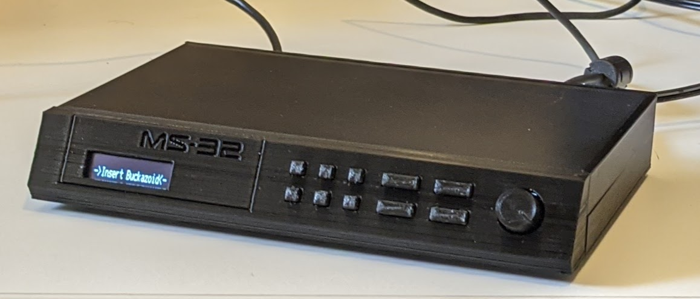

# Minisynth 32

A 3D-printable MIDI synthesizer inspired by the Roland MT-32 and
[clumsyMIDI](https://github.com/gmcn42/clumsyMIDI), and powered by the
[mt32-pi](https://github.com/dwhinham/mt32-pi/wiki) MT-32 emulator.

## Features

* 3D printable shell, 50% scale of the original MT-32
* GY-PCM5102 HiFi DAC board
* Front panel PCB with 2-10 tactile switches and 0.91" OLED Display
* Optional 2- or 10-button clickable front panel (only 2 buttons are functional)
* Rear I/O breakout PCB with 5.5mm power jack and pushbutton power switch
* Rotary encoder volume dial (generic 12mm shaft with no carrier board)
* MIDI Input via DIN5 MIDI cable or USB (using additional Arduino board)
* Completely through-hole soldering, no surface mount components
* Works with the Raspberry Pi "A" or "B" variants

## Warnings

**NO WARRANTY is provided, and no guarantee that all or any of the parts will
fit together. 3D printing is time-consuming and an art at the best of times.**

However, if you're stuck or have a question, feel free to open an issue on
GitHub, and the worst you'll get is sympathy.

## Assembly Notes

Check the [Bill of Materials](minisynth32-bom.csv) for all of the parts needed,
and the [project wiki](https://github.com/grantek/minisynth32/wiki) for the
build guide with pictures, a [text-only copy](build-guide.md) is included in
this repository.

## News

This is "Version 2.0" of the Minisynth 32, the previous version had a simpler
faceplate with 2 large, easy to print buttons. If you're looking for the old
version, see the "ms32-v1.0" tag/release.

